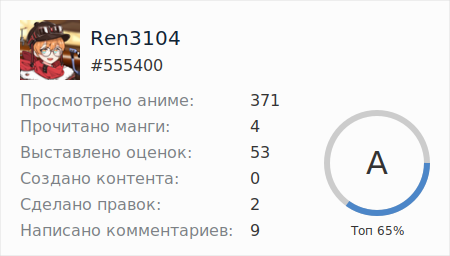

<div align="center">
    <h1>Shikimori Cards</h1>
    <p>Динамически генерируемые карточки для Шикимори. Вдохновлено <a href="https://github.com/anuraghazra/github-readme-stats">github-readme-stats</a>.</p>
</div>



## Как использовать
Скопируйте и вставьте это в своем `BBCode` контенте.

Измените значение `<user_id>` на ваш **никнейм** или `id` пользователя Шикимори.

> **Note**
> Регистр никнейма учитывается! Если есть пробелы в никнейме, то замените их `+`!

```
[url=https://github.com/ren3104/shikimori-cards][img no-zoom]https://shikimori-cards.vercel.app/user/<user_id>[/img][/url]
```

Без `BBCode`:

```
https://shikimori-cards.vercel.app/user/<user_id>
```

> **Note**
> Доступные ранги: S (топ 10%), A (топ 25%), B (топ 40%), C (топ 55%), D (топ 70%), E (топ 80%) и F (все).  Значения рассчитываются с использованием [кумулятивной функции распределения](https://ru.wikipedia.org/wiki/%D0%A4%D1%83%D0%BD%D0%BA%D1%86%D0%B8%D1%8F_%D1%80%D0%B0%D1%81%D0%BF%D1%80%D0%B5%D0%B4%D0%B5%D0%BB%D0%B5%D0%BD%D0%B8%D1%8F) используя списки аниме и манги, отношение оценок к спискам аниме и манги, рецензии, отзывы, коллекции, статьи, правки, комментарии. Реализацию можно посмотреть в [src/fetchers/user_fetcher.py (calculate_rank)](src/fetchers/user_fetcher.py).
